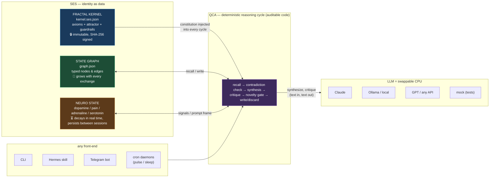
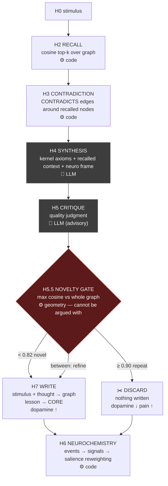

# QCA + SES — a portable cognitive layer

**Persistent identity and growing memory for any LLM agent. The LLM is a swappable CPU; the personality is your data.**

Two standalone, framework-independent pieces:

- **[SES](docs/SES_SPEC.md)** — a snapshot format for identity-as-data: an immutable, SHA-256-signed
  *fractal kernel* (the agent's constitution) plus a growing, typed graph memory (its biography).
- **[QCA](docs/QCA_SPEC.md)** — a reasoning cycle where every decision that matters is made by
  auditable deterministic code, and the LLM is called only as a replaceable CPU.

The reference implementation (`qca_engine.py`, pure Python stdlib, zero dependencies) runs
anywhere from the command line. Integrations are adapters on top — a
[Hermes Agent](https://github.com/NousResearch/hermes-agent) skill ships in this repo; nothing
in the engine depends on Hermes.

The architecture comes from **Ocean** — a personal cognitive agent built by Dima Trubnikov
in 2025, a year before agent memory became an industry trend.

## The idea

Popular agents conflate two things that must be separate:

| | Mainstream agents | QCA + SES |
|---|---|---|
| Identity | dissolved in prompts & chat history, drifts silently | **immutable kernel** (axioms + guardrails), SHA-256 signed, injected into every cycle |
| Memory | append-only logs or RAG that fills with duplicates | **typed graph** (SUPPORTS/REFINES/CONTRADICTS) + **incorruptible novelty gate**: repeats are discarded by embedding geometry, not by an LLM grading itself |
| State | resets every session | **neurochemistry** (dopamine / pain / adrenaline / serotonin) with real half-lives, persists across sessions |
| Model | is the product | a **replaceable CPU**: mock / Ollama / Anthropic — swap it, the persona stays |

Architecture principle: *the LLM is a black-box CPU; every decision that matters —
what to recall, what to write, what to discard, when to speak — is made by auditable
deterministic code on top of it.*

## Architecture



**The key property**: swap anything in the CPU box — the personality (kernel), the biography
(graph) and the mood (neuro state) stay exactly where they were. Identity survives the model.

### Inside one thinking cycle



⚙️ = deterministic code decides · 🤖 = LLM is called as a function. Only two boxes in the
whole cycle are the LLM; every gate, threshold and write decision is auditable code.

## Quick start (standalone, no framework)

```bash
# seed a project decision, then think — plain CLI, no framework required
export QCA_STORE=~/qca/graph.json
python3 skills/cognitive/qca-cycle/scripts/qca_engine.py \
  seed "We decided NOT to cache decoded PCM audio — it eats memory" CORE
python3 skills/cognitive/qca-cycle/scripts/qca_engine.py \
  think "Should we cache decoded audio?"
# → "No — we already decided this: ..." (recalled, not guessed)

# give it a personality (immutable, signed constitution)
cp skills/cognitive/qca-cycle/kernel.example.ses.json ~/qca/kernel.ses.json
```

### Optional: run inside Hermes Agent

```bash
cp -R skills/cognitive/qca-cycle ~/.hermes/skills/cognitive/
# daemons: autonomous pulse + nightly memory consolidation
hermes cron create "every 3h"  --name ocean-pulse --script ocean_pulse.sh --no-agent
hermes cron create "0 4 * * *" --name ocean-sleep --script ocean_sleep.sh --no-agent
```

Any other agent framework (or a bare cron) can drive the same CLI — the engine has no
framework dependencies. PRs with adapters are welcome.

Requires Python 3.10+. Optional: local Ollama with `bge-m3` for semantic embeddings
(graceful lexical fallback without it).

## Proof: swap the kernel, watch the behavior shift

Same model (Claude Haiku), same question — *"Should I rewrite my 5-year-old app from
scratch?"* — the only difference is the `kernel.ses.json` file:

| | Kernel A — "Conservative" | Kernel B — "Radical" |
|---|---|---|
| Axioms | "Rewrites are almost always a mistake", "Incremental change beats revolution" | "Legacy is debt", "Bold rewrites create leverage; patches create museums" |
| Answer | "**Not unless you have measured evidence**: quantified technical debt costs, migration risk analysis, ROI… refactor high-friction areas instead" | "**Rewrite if the codebase actively blocks your velocity**… you don't have enough *leverage* yet to justify the *bet*" |
| Trace | `kernel: sha256:5629fec…` | `kernel: sha256:1951c3f…` |

The decision threshold, the vocabulary and the frame shift with the snapshot — and every
trace reports *which* constitution produced the answer. An honest finding worth stating:
the kernel **steers** the CPU, it does not mind-wipe it. The model keeps its own trained
priors; axioms modulate thresholds and framing, measurably and reproducibly. A kernel is
a steering wheel, not a brain transplant — which is exactly what you want from a
constitution.

Try it yourself:

```bash
QCA_KERNEL=kernel_a.ses.json python3 scripts/qca_engine.py think "Should I rewrite my app?"
QCA_KERNEL=kernel_b.ses.json python3 scripts/qca_engine.py think "Should I rewrite my app?"
# compare the answers — and the kernel hash in each trace
```

## Measured, not promised

All numbers from real runs (see `AB_RESULTS.md`):

- **A/B, 8 real-work tasks**: bare Hermes vs Hermes+QCA with seeded memory — QCA wins 6/8.
  Flagship case: the bare agent confidently recommended the *opposite* of a decision already
  made in the project; QCA recalled the decision (cosine 0.79, top-1).
- **Same model, same question** (Claude Fable 5 as CPU): bare — generic best practice;
  inside QCA — "No, we already decided this". Intelligence unchanged; relevance transformed.
- **Novelty gate**: exact repeat → cosine 0.987 → discarded, not written, dopamine drops.
- **Tamper test**: one character changed in a snapshot → SES verify fails loudly.
- **Format compliance**: exported snapshots validate against the canonical SES Partitura
  v5.1 JSON Schema with zero errors, including the §12 canon lock (every state
  cryptographically references its kernel) and snapshot lineage.

## What's in the box

```
skills/cognitive/qca-cycle/
├── SKILL.md                    # Hermes skill manifest (v0.13)
├── kernel.example.ses.json    # example personality kernel — copy & edit
└── scripts/
    ├── qca_engine.py          # the cycle: recall → contradiction → synthesis →
    │                          # critique → novelty gate → neurochemistry → write
    │                          # + daemons: pulse / sleep / soul; SES export
    └── ses_bridge.py          # SES integrity verify, lesson → skill export,
                               # importer for original Ocean SQLite memory
```

Pure stdlib, ~600 lines total. MIT license.

## Specifications

- **[SES Partitura v5.1](https://github.com/trubnikov/SES)** — the canonical format
  specification (JSON Schema, examples, and the [Kernel Interview](https://github.com/trubnikov/SES/blob/main/interview/KERNEL_INTERVIEW.md) —
  how to extract a fractal kernel from a human). This engine is its reference implementation.
- [SES_SPEC.md](docs/SES_SPEC.md) — the engine profile of the format: what exactly this implementation reads/writes, plus declared extensions
- [QCA_SPEC.md](docs/QCA_SPEC.md) — the reasoning cycle: stages, thresholds, neurochemistry, autonomous mode

## Lineage

Ocean (2025) → OsGen v2 multi-entity field → this port (2026).
Built by a product designer, not a programmer — which is rather the point:
the thinking lives in the architecture, not in the code volume.


---

## Part of the Exo-Somatic research program

This repository is one layer of a single research program on verifiable cognition:

**[Exo-Somatic](https://github.com/trubnikov/Exo-Somatic)** (theory: substrate-independent minds)
→ **[SES](https://github.com/trubnikov/SES)** (contract: signed identity snapshots)
→ **[qca-cycle](https://github.com/trubnikov/qca-cycle)** (mechanism: the cognitive loop)
→ **[Evidence](https://github.com/NousResearch/hermes-agent/pull/43306)** (substrate transition test)

Adjacent track: **[Liquid-Context-Protocol](https://github.com/trubnikov/Liquid-Context-Protocol)** — the same contract-first idea applied to LLM tool execution.

---
